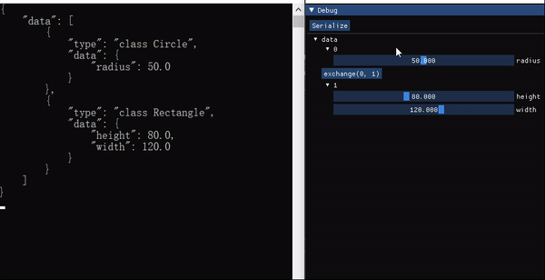

# cppreflection

A tiny and extensible C++ reflection framework with implementation of Serialization and AutoImGui.

## Example



```c++
class Shapes : public ISerialization, public IAutoImGui {
public:
    std::vector<std::unique_ptr<Shape>> data;

FIELD_DECLARATION_BEGIN(Shapes, ISerialization)
    FIELD_DECLARATION("data", data)
FIELD_DECLARATION_END()

FIELD_DECLARATION_BEGIN(Shapes, IAutoImGui)
    FIELD_DECLARATION("data", data)
FIELD_DECLARATION_END()
};
```

```c++
class Shape : public ISerialization, public IAutoImGui {
public:
    virtual ~Shape() {};
};

class Circle : public Shape {
public:
    float radius{};

FIELD_DECLARATION_BEGIN(Circle, ISerialization)
    FIELD_DECLARATION("radius", radius)
FIELD_DECLARATION_END()

FIELD_DECLARATION_BEGIN(Circle, IAutoImGui)
    FIELD_DECLARATION("radius", radius, { { AutoImGuiArg::SliderFloatMin, 0.0f }, {AutoImGuiArg::SliderFloatMax, 100.0f} })
FIELD_DECLARATION_END()
};

class Rectangle : public Shape {
public:
    float width{};
    float height{};

FIELD_DECLARATION_BEGIN(Rectangle, ISerialization)
    FIELD_DECLARATION("width", width)
    FIELD_DECLARATION("height", height)
FIELD_DECLARATION_END()

FIELD_DECLARATION_BEGIN(Rectangle, IAutoImGui)
    FIELD_DECLARATION("width", width, { { AutoImGuiArg::SliderFloatMin, 0.0f }, {AutoImGuiArg::SliderFloatMax, 200.0f} })
    FIELD_DECLARATION("height", height, { { AutoImGuiArg::SliderFloatMin, 0.0f }, {AutoImGuiArg::SliderFloatMax, 200.0f} })
FIELD_DECLARATION_END()
};

SUBCLASS_DECLARATION_BEGIN(Shape)
    SUBCLASS_DECLARATION(Circle)
    SUBCLASS_DECLARATION(Rectangle)
SUBCLASS_DECLARATION_END()
```